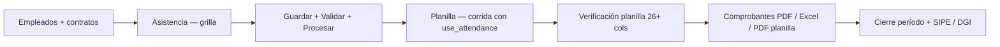

# EPayRoll — Contexto para el analista funcional

**Audiencia:** analista de planilla / RR.HH. / operaciones que valida reglas, pantallas y cifras.  
**Última actualización:** 2026-06-21  
**Commit de referencia:** `accecae` (main)  
**Producción:** https://eplanilla.etsrv.site/app/  
**Repositorio:** https://github.com/shidalgo0925/EPayRoll

Documentos técnicos complementarios: [EPAYROLL_STATUS.md](./EPAYROLL_STATUS.md) · [EPAYROLL_DATA_MODEL.md](./EPAYROLL_DATA_MODEL.md) · [EPAYROLL_PANAMA_COMPLIANCE_BLUEPRINT.md](./EPAYROLL_PANAMA_COMPLIANCE_BLUEPRINT.md)

---

## 1. Qué es EPayRoll (en una frase)

Sistema de **planilla quincenal Panamá** (CSS, SE, ISR) con **asistencia intermedia estándar**, **verificación operador** tipo Excel de planilla, comprobantes PDF, vacaciones, incapacidades y liquidaciones.

**Regla de oro:** la planilla **no captura** horas sueltas en la grilla final; primero se guardan **hechos de asistencia**, luego el motor calcula días, extras y descuentos.

**Empresa de referencia:** la primera organización del tenant es **Easy Technology Services S.A.** — planilla piloto y datos demo.

---

## 2. Entorno operativo (apps srv)

| Recurso | Valor |
|---------|--------|
| UI web | https://eplanilla.etsrv.site/app/ |
| API | puerto **8001** (`epayroll-api` systemd) |
| PostgreSQL | puerto **5433** |
| **Empresa principal (1.ª org)** | **Easy Technology Services S.A.** — `00000000-0000-0000-0000-000000000010` |
| Tenant | `00000000-0000-0000-0000-000000000001` (Easy Technology Services) |
| Bundle UI actual | `bundle.js?v=45`, `app.css?v=25` |

Tras despliegue de código: `sudo systemctl restart epayroll-api` y **Ctrl+F5** en el navegador.

---

## 3. Flujo operativo end-to-end (lo que debe validar el analista)



### Pasos en la UI (`/app`)

1. **Empleados** — alta, ficha, cédula, teléfono, contrato (salario quincenal).
2. **Períodos** — quincena (ej. 1–15 jun 2026).
3. **Asistencia** — grilla empleados × días:
   - Horario programado: **08:00–12:00** y **13:00–17:00**.
   - Captura por celda: entrada/salida mañana y tarde.
   - Panel **Descuento** por tardanza o salida anticipada (vs horario programado).
   - A/V/I = ausencia, vacaciones, incapacidad.
   - Botones: *Generar tabla default*, *Guardar cambios*, *Validar*, *Procesar → planilla*.
   - *Cargar empleados de planilla* (solo empleados de la corrida activa).
4. **Planilla** — ejecutar corrida con **usar asistencia** activado.
5. **Verificación planilla** — grilla operador (columnas del Excel modelo + descuentos de tiempo).
6. **Comprobantes** — PDF por empleado tras cerrar corrida.

---

## 4. Asistencia — diseño acordado con negocio

### 4.1 Tabla estándar (`attendance_facts`)

Guarda **hechos**, no montos de planilla.

| Campo | Ejemplo | Notas |
|-------|---------|--------|
| empleado / cédula | 8-888-8888 | |
| fecha | 2026-06-02 | |
| turno | DIURNO | |
| hora_entrada | 08:10 | Primera entrada del día |
| hora_salida | 17:00 | Última salida del día |
| descanso_minutos | 60 | Almuerzo (gap 12:00→13:00) |
| tipo_día | NORMAL / DOMINGO / FERIADO | |
| ausencia / vacaciones / incapacidad | sí/no | |
| observacion | metadata + texto libre | Ver §4.3 |

Estados: `PENDIENTE`, `VALIDO`, `ERROR`.

### 4.2 Descuento por tardanza / salida anticipada

**No es el almuerzo.** Es tiempo no cumplido vs horario fijo:

| Situación | Ejemplo | Minutos descontados |
|-----------|---------|---------------------|
| Llegada tarde | Entrada 08:10 | 10 min |
| Salida temprana | Sale 15:00 (programado 17:00) | 120 min |
| Combinado | 08:15 → 15:00 | 15 + 120 = 135 min |

Se compara cada tramo contra:

- Entrada mañana → **08:00**
- Salida mañana → **12:00**
- Entrada tarde → **13:00**
- Salida tarde → **17:00**

**UI:** panel rojo *Descuento* en cada celda + campos en rojo/naranja.  
**Resumen quincenal:** columna *Desc. min* por empleado.

### 4.3 Metadata en `observacion`

La UI persiste tramos intermedios y totales sin migrar columnas extra:

```
EPAYROLL_ATT_SPLIT:{"amOut":"12:00","pmIn":"13:00"}
EPAYROLL_DESCUENTO:{"minutos":135}
```

Texto libre del operador puede ir en líneas siguientes.

### 4.4 Cálculo de horas para extras

Desde hechos válidos → `attendance_daily` → motor suma extras, domingo, feriado.  
El descanso de almuerzo reduce horas netas: `(salida − entrada) − descanso_minutos`.

---

## 5. Planilla — descuentos en verificación

Columnas **nuevas** en verificación (seed `planilla_modelo_columns.json`):

| Columna UI | Clave | Significado |
|------------|-------|-------------|
| MIN. DESC. | `descuento_minutos` | Minutos acumulados del período (tardanza + salida anticipada) |
| HR. DESC. | `descuento_horas` | Equivalente decimal (ej. 135 min → 2.25) |
| DESCT. TIEMPO | `monto_desc_tiempo` | Monto B/. descontado por tiempo |
| DIAS DE DESC. | `dias_descuento` | Días completos (ausencias + vacaciones) |
| TOTAL DESCT. | `monto_desc_dias` | Monto por días de ausencia/vacaciones |

### Fórmula DESCT. TIEMPO

```
salario_hora = salario_mensual ÷ 30 ÷ 8
monto = salario_hora × (descuento_minutos ÷ 60)
```

Ejemplo: salario B/. 1,800, 135 min → **B/. 16.88**.

### Deducción en corrida

Concepto **`DESCUENTO_ASISTENCIA`** (tipo DESCUENTO) se agrega a la corrida y reduce neto.  
Datos en tabla `payroll_run_adjustments`: `descuento_minutos`, `monto_desc_tiempo`.

**Importante:** si la corrida se ejecutó **antes** de este cambio, la verificación **recalcula minutos/horas** leyendo asistencia actual; para que el **neto** incluya el descuento hay que **volver a correr planilla con asistencia**.

---

## 6. Módulos entregados (mapa para revisión)

### 6.1 Planilla operador

| Entregable | Dónde |
|------------|--------|
| Vista 26+ columnas | Planilla → Verificación planilla |
| Export Excel | `GET .../planilla/export.xlsx` |
| Export PDF apaisado | `GET .../planilla/export.pdf` |
| Ajustes inline | préstamo, banco, DEV ISR, días descuento (API + celdas editables) |
| Tasas legales por org | Config legal + seed defaults |
| Cuentas contables por concepto | Config legal |

### 6.2 Comprobantes

| Entregable | Dónde |
|------------|--------|
| Lista por corrida | Planilla → Comprobantes |
| PDF recibo | Descarga por empleado |
| Datos JSON | `GET .../payslips/{id}/data` |

### 6.3 Asistencia

| Entregable | Dónde |
|------------|--------|
| Grilla matriz UI | Asistencia |
| CSV import | Plantilla `docs/seed/attendance_import_template.csv` |
| API facts / bulk / grid | Ver §8 |
| Procesar → planilla | Genera `attendance_daily` + resumen |

### 6.4 Vacaciones

| Función | UI / API |
|---------|----------|
| Solicitud / aprobación / rechazo | Vacaciones |
| Marcar gozado | API `.../gozado` |
| Sustituto en cobertura | API sustituto |
| Sync asistencia al aprobar | Marca V en grilla del período |

### 6.5 Incapacidades

| Función | UI / API |
|---------|----------|
| Registro GT-10 | Incapacidades |
| Sync asistencia | Marca I en fechas del rango |
| Impacto planilla | `calculate_period_impact` en corrida |

### 6.6 Liquidaciones

| Función | UI / API |
|---------|----------|
| Contexto automático (YTD, vacaciones) | `GET .../termination/context` |
| Cálculo GT-05/GT-06 | `POST .../termination/calculate` |
| PDF liquidación | `GET .../termination/{id}/export.pdf` |

---

## 7. Equipo demo (script reset)

Script: `python scripts/reset_and_seed_planilla_team.py`

Borra datos operativos + empleados y crea:

| Ficha | Nombre | Cédula | Salario mensual |
|-------|--------|--------|-----------------|
| 1 | Juan Pérez Demo | 8-888-8888 | B/. 1,800 |
| 2 | Narciso Villamil | 9-219-884 | B/. 425 |
| 3 | Seul Hidalgo | 8-382-685 | B/. 1,025 |
| 4 | David Fernandez | 4 | B/. 825 |
| 5 | Abigail Govea | 8-993-1252 | B/. 650 |

También crea período **1–15 jun 2026**, grilla asistencia default y una corrida inicial.

**Caso de prueba descuentos:** Narciso el **02/06/2026** con entrada **08:15** y salida **15:00** → ~135 min → verificar MIN./HR. DESC. y DESCT. TIEMPO en verificación.

---

## 8. API — endpoints clave para el analista

Base: `https://eplanilla.etsrv.site` (Swagger: `/docs`)

Headers en modo stub: `X-Tenant-Id`, `X-Organization-Id`, `X-Roles`.

### Asistencia

| Método | Ruta | Uso |
|--------|------|-----|
| GET | `/api/v1/organizations/{org}/attendance/facts` | Listar hechos |
| POST | `/api/v1/organizations/{org}/attendance/grid/save` | Guardar grilla |
| POST | `/api/v1/organizations/{org}/attendance/grid/ensure` | Crear celdas default (`run_id` opcional) |
| POST | `/api/v1/organizations/{org}/attendance/validate` | Validar período |
| POST | `/api/v1/organizations/{org}/attendance/process` | Procesar → daily |
| GET | `/api/v1/organizations/{org}/attendance/summary` | Resumen quincenal |

### Planilla

| Método | Ruta | Uso |
|--------|------|-----|
| POST | `/api/v1/payroll/periods/{id}/run` | Corrida (`use_attendance: true`) |
| GET | `/api/v1/payroll/runs/{id}/planilla` | Verificación operador |
| GET | `/api/v1/payroll/runs/{id}/planilla/export.xlsx` | Excel |
| GET | `/api/v1/payroll/runs/{id}/planilla/export.pdf` | PDF |
| PATCH | `/api/v1/payroll/runs/{id}/adjustments/{emp}` | Ajustes manuales |
| GET | `/api/v1/payroll/runs/{id}/payslips` | Lista comprobantes |

---

## 9. Base de datos — migraciones relevantes

| # | Archivo | Qué agrega |
|---|---------|------------|
| 010 | `010_planilla_operational.sql` | Ficha, `payroll_run_adjustments`, tasas/cuentas org |
| 011 | `011_attendance_facts.sql` | Tabla estándar asistencia |
| 012 | `012_payroll_attendance_descuento.sql` | `descuento_minutos`, `monto_desc_tiempo` en ajustes |

Aplicar en srv:

```bash
docker exec -i epayroll-db psql -U epayroll -d epayroll -v ON_ERROR_STOP=1 \
  < database/migrations/012_payroll_attendance_descuento.sql
```

Concepto nuevo en seed: **`DESCUENTO_ASISTENCIA`** (`docs/seed/payroll_concepts.json`).

---

## 10. Archivos de código (para preguntas al dev)

| Tema | Archivo principal |
|------|---------------------|
| UI asistencia + descuentos | `ui/static/js/bundle.js` |
| Cálculo minutos descuento | `src/epayroll/attendance/validator.py` → `compute_descuento_minutos` |
| Monto descuento planilla | `src/epayroll/attendance/payroll_descuento.py` |
| Corrida + deducción | `src/epayroll/db/repositories.py` |
| Vista verificación | `src/epayroll/db/legal_config_repository.py` → `PlanillaViewRepository` |
| Columnas Excel modelo | `docs/seed/planilla_modelo_columns.json` |
| Export planilla | `src/epayroll/export/planilla.py` |
| PDF liquidación | `src/epayroll/payslip/liquidation_pdf.py` |

---

## 11. Tests automatizados (referencia de calidad)

```bash
python -m pytest tests/test_attendance_facts.py -v          # hechos + descuento minutos
python -m pytest tests/test_attendance_payroll_descuento.py -v  # monto B/.
python -m pytest tests/test_planilla_view.py -v             # vista + export
python -m pytest tests/test_benefits_workflow.py -v       # vacaciones / incap / liquidación
```

---

## 12. Checklist de validación para el analista

### Asistencia

- [ ] Celda con horario exacto 08:00–17:00 muestra **Descuento: 0 min**.
- [ ] Entrada 08:10 muestra **10 min** y campo entrada en rojo.
- [ ] Salida 15:00 muestra **120 min** adicionales y salida tarde en naranja.
- [ ] Guardar + recargar conserva horas y descuentos.
- [ ] Procesar genera resumen con *Desc. min* correcto.

### Planilla

- [ ] Corrida con **use_attendance** activo.
- [ ] Verificación muestra **MIN. DESC.**, **HR. DESC.**, **DESCT. TIEMPO**.
- [ ] Neto disminuye vs corrida sin tardanzas (concepto DESCUENTO_ASISTENCIA).
- [ ] Export Excel/PDF incluye columnas nuevas.
- [ ] Comprobante refleja deducciones coherentes.

### Vacaciones / incapacidades

- [ ] Aprobar vacaciones marca V en asistencia del rango.
- [ ] Incapacidad marca I y reduce días efectivos según reglas.

---

## 13. Pendientes / fuera de alcance actual

| Item | Estado |
|------|--------|
| Planilla honorarios (hoja 2 Excel) | No implementada |
| Histórico acumulado empleado (`employee_payroll_acumulado`) | Mencionado, no en UI |
| Cheques | Backlog |
| Validación contador golden tests en producción | Script listo, firma pendiente |
| SIPE portal CSS | Prueba ambiente CSS |
| Horario programado distinto por empleado/turno | Hoy fijo 08–12 / 13–17 para todos |

---

## 14. Bitácora de entregas recientes (2026-06)

| Tema | Entregado |
|------|-----------|
| Comprobantes PDF + lista UI | ✅ |
| Export verificación planilla XLSX/PDF | ✅ |
| Asistencia grilla 4 tramos + A/V/I | ✅ |
| Cargar empleados desde corrida planilla | ✅ |
| Descuento tardanza/salida anticipada UI | ✅ |
| Descuento integrado verificación + corrida | ✅ |
| Vacaciones reject/gozado + sync asistencia | ✅ |
| Incapacidades + sync asistencia | ✅ |
| Liquidaciones contexto + PDF | ✅ |
| Script reset 5 empleados demo | ✅ |
| CRUD períodos planilla | ✅ |

---

## 15. Contacto técnico / continuidad

Para retomar desarrollo: indicar al agente Cursor *"continúa según docs/ANALISTA_CONTEXTO.md"* o *docs/EPAYROLL_STATUS.md*.

**Comandos post-pull en srv:**

```bash
cd /opt/EPayRoll && git pull
# migraciones nuevas si las hay
sudo systemctl restart epayroll-api
```

---

*Documento preparado para handoff analista ↔ desarrollo. Actualizar al cerrar validación de negocio.*
