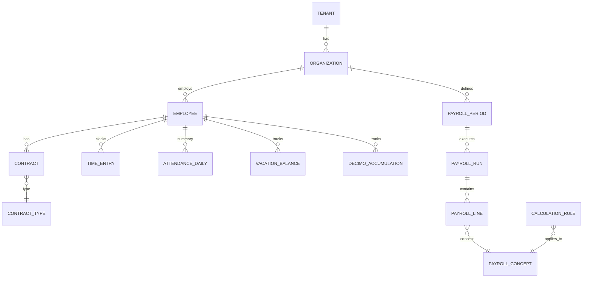

# EPAYROLL_DATA_MODEL.md

**Versión:** 1.0 (borrador)  
**Estado:** Fase 1 implementada — migraciones SQL + seed  
**Implementación:** [`database/`](../database/)  
**Padre:** [EPAYROLL_MASTER_PLAN.md](./EPAYROLL_MASTER_PLAN.md)  
**Propósito:** Entidades, relaciones y catálogos de EPayRoll

---

## 1. CONVENCIONES

- Todas las tablas maestras legales incluyen: `activo`, `vigencia_desde`, `vigencia_hasta`, auditoría (`created_at`, `created_by`, `updated_at`, `updated_by`)
- IDs: UUID o bigint según decisión en [Tech Architecture](./EPAYROLL_TECH_ARCHITECTURE.md)
- Soft delete: desactivar con vigencia, nunca borrar histórico legal
- Multi-tenant: `tenant_id` + `organization_id` en entidades operativas

---

## 2. CAPAS DEL MODELO

```
┌─────────────────────────────────────────┐
│  TENANT / ORGANIZACIÓN (EN1)            │
├─────────────────────────────────────────┤
│  OPERATIVO: empleados, contratos,       │
│  planillas, asistencia, acumulados      │
├─────────────────────────────────────────┤
│  MAESTRAS LEGALES (9 dominios)          │
│  → ver Compliance Blueprint             │
├─────────────────────────────────────────┤
│  AUDITORÍA / HISTÓRICO                  │
└─────────────────────────────────────────┘
```

---

## 3. TENANT Y ORGANIZACIÓN

| Entidad | Descripción | Campos clave |
|---------|-------------|--------------|
| `tenants` | Cliente SaaS (EN1) | id, nombre, slug, config_json |
| `organizations` | Empresa / sucursal dentro del tenant | id, tenant_id, razón_social, ruc, actividad_economica_id, region_id, codigo_css_riesgo |
| `organization_settings` | Config por empresa | organization_id, periodo_pago (quincenal/mensual), moneda, zona_horaria |

---

## 4. EMPLEADOS Y EXPEDIENTE

| Entidad | Descripción | Campos clave |
|---------|-------------|--------------|
| `employees` | Persona trabajadora | id, organization_id, cedula, nombres, apellidos, fecha_nacimiento, estado_civil, direccion, telefono, email, activo |
| `employee_dependents` | Dependientes | employee_id, nombre, parentesco, fecha_nacimiento |
| `employee_documents` | Expediente digital | employee_id, tipo_documento, archivo_url, fecha_vencimiento |
| `employee_history` | Eventos laborales | employee_id, tipo_evento, fecha, descripcion, metadata_json |

---

## 5. CONTRATOS

| Entidad | Descripción | Campos clave |
|---------|-------------|--------------|
| `contract_types` | Catálogo → Compliance `tipos_contrato` | código, flags prestaciones |
| `contracts` | Contrato vigente/histórico | employee_id, contract_type_id, fecha_inicio, fecha_fin, salario_base, forma_pago (mensual/quincenal/hora), ocupacion_id, turno_id, estado |
| `contract_amendments` | Adendas | contract_id, tipo, valor_anterior, valor_nuevo, fecha_vigencia, motivo |
| `salary_changes` | Historial salarial | contract_id, salario_anterior, salario_nuevo, fecha_vigencia |

---

## 6. ASISTENCIA Y TIEMPO

| Entidad | Descripción | Campos clave |
|---------|-------------|--------------|
| `shifts` | Turnos → Compliance `tipos_horario_turno` | organization_id, código, hora_inicio, hora_fin, tipo_jornada |
| `schedules` | Asignación turno por empleado | employee_id, shift_id, fecha_inicio, fecha_fin |
| `time_entries` | Marcaciones | employee_id, timestamp_entrada, timestamp_salida, fuente (manual/reloj/app) |
| `attendance_daily` | Resumen diario calculado | employee_id, fecha, horas_ordinarias, horas_extra_diurna, horas_extra_nocturna, es_feriado, es_dominio |
| `absences` | Ausencias / tardanzas | employee_id, fecha, tipo, justificada, horas |
| `incapacities` | Incapacidades CSS / fondo licencia | employee_id, fecha_inicio, fecha_fin, tipo, certificado_ref, dias_subsidio_css |

---

## 7. PLANILLA

| Entidad | Descripción | Campos clave |
|---------|-------------|--------------|
| `payroll_periods` | Período de planilla | organization_id, tipo, fecha_inicio, fecha_fin, fecha_pago, estado (borrador/cerrado/anulado) |
| `payroll_runs` | Corrida de nómina | payroll_period_id, fecha_ejecucion, ejecutado_por, version_motor, config_snapshot_json |
| `payroll_lines` | Detalle por empleado/concepto | payroll_run_id, employee_id, concept_id, cantidad, base, monto, orden |
| `payroll_employee_summary` | Totales por empleado | payroll_run_id, employee_id, bruto, deducciones, neto, aportes_patronales |
| `payslips` | Recibos generados | payroll_run_id, employee_id, pdf_url, fecha_emision |

---

## 8. PRESTACIONES Y ACUMULADOS

| Entidad | Descripción | Campos clave |
|---------|-------------|--------------|
| `vacation_balances` | Saldo vacaciones | employee_id, dias_ganados, dias_gozados, dias_pendientes, fecha_corte |
| `vacation_requests` | Solicitudes / programación | employee_id, fecha_inicio, fecha_fin, estado, aprobado_por |
| `decimo_accumulations` | Acumulado décimo | employee_id, trimestre, año, salarios_sumados, monto_calculado, pagado |
| `seniority_provisions` | Provisión prima antigüedad | employee_id, semanas_acumuladas, monto_provisionado |
| `severance_fund` | Fondo cesantía | employee_id, cotizaciones_trimestrales, saldo |
| `termination_cases` | Liquidaciones | employee_id, fecha_terminacion, causa, monto_vacaciones, monto_decimo, monto_prima, monto_preaviso, monto_indemnizacion, total |

---

## 9. TABLAS MAESTRAS LEGALES

Referencia completa: [Compliance Blueprint](./EPAYROLL_PANAMA_COMPLIANCE_BLUEPRINT.md)

| Grupo | Tablas |
|-------|--------|
| Laboral | `contract_types`, `payroll_concepts`, `calculation_rules`, `shifts`, `holidays`, `employee_concept_assignments` |
| CSS | `css_rates`, `css_contributable_concepts` |
| SE | `se_rates` |
| ISR | `isr_brackets`, `isr_config` |
| Décimo | `decimo_config` |
| Salario mínimo | `sm_activities`, `sm_regions`, `sm_occupations`, `sm_rates` |
| Riesgo | `professional_risk_rates`, `organization_risk_classification` |

---

## 10. CUMPLIMIENTO Y EXPORTACIÓN

| Entidad | Descripción | Campos clave |
|---------|-------------|--------------|
| `sipe_exports` | Envíos SIPE | payroll_run_id, archivo, fecha_envio, estado, errores_json |
| `dgi_exports` | Retenciones DGI | payroll_run_id, formulario, periodo, monto_total, archivo |
| `bank_exports` | Archivos ACH | payroll_run_id, banco, archivo, estado |

---

## 11. AUDITORÍA

| Entidad | Descripción | Campos clave |
|---------|-------------|--------------|
| `audit_log` | Log inmutable | entity_type, entity_id, action, user_id, timestamp, old_values_json, new_values_json |
| `rule_versions` | Versionado reglas legales | rule_id, version, snapshot_json, vigencia_desde, vigencia_hasta, approved_by |

---

## 12. DIAGRAMA ER (ALTO NIVEL)



---

## 13. ÍNDICES Y PERFORMANCE

- `(organization_id, employee_id, fecha)` en asistencia
- `(payroll_run_id, employee_id)` en líneas de planilla
- `(vigencia_desde, vigencia_hasta)` en tablas legales
- Particionado por año en `audit_log` y `payroll_runs` (evaluar en Tech Architecture)

---

## 14. ESTADO FASE 1

- [x] Decisión UUID (PostgreSQL gen_random_uuid)
- [ ] Esquema EN1 tenant — mapeo exacto de campos
- [x] `config_snapshot` JSONB en payroll_runs
- [ ] Catálogo ocupaciones MITRADEL / CSS (sm_occupations vacío)
- [x] Migraciones SQL: 7 archivos, 40+ tablas
- [x] Seed loader: `scripts/seed.py`

## 15. PENDIENTES

---

*Documento hijo de EPAYROLL_MASTER_PLAN — Easy Technology Services*
