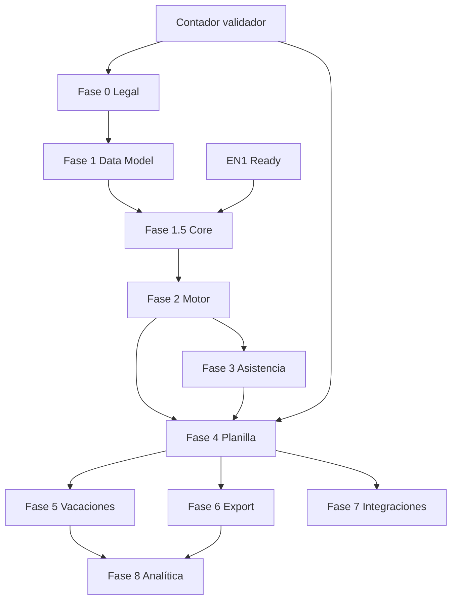

# EPAYROLL_ROADMAP.md

**Versión:** 1.1  
**Estado:** MVP backend completo — piloto en apps srv pendiente  
**Padre:** [EPAYROLL_MASTER_PLAN.md](./EPAYROLL_MASTER_PLAN.md)  
**Propósito:** Fases, sprints, entregables y dependencias  
**Continuación:** [EPAYROLL_STATUS.md](./EPAYROLL_STATUS.md) ← **leer al retomar**

---

## 0. ESTADO ACTUAL (2026-06-13)

| | |
|---|---|
| **Hecho** | Fases 0–8 en código + 40 tests unitarios |
| **Bloqueado** | Piloto BD en PC local (sin Docker) |
| **Siguiente** | Bootstrap en **apps srv** → checklist piloto en [EPAYROLL_STATUS §3.4](./EPAYROLL_STATUS.md#34-piloto-end-to-end-checklist--siguiente-tarea) |
| **Después** | Auth EN1, UI web, validación contador |

---

## 1. RESUMEN DE FASES

| Fase | Nombre | Duración est. | Entregable clave |
|------|--------|---------------|------------------|
| 0 | Marco Legal | 2–3 semanas | Compliance Blueprint completo + golden tests definidos |
| 1 | Modelo de Datos | 2 semanas | ER aprobado + migraciones base |
| 1.5 | Core Operativo | 3–4 semanas | CRUD empleados, contratos, catálogos |
| 2 | Motor de Reglas | 4–6 semanas | Motor + seed legal + corrida stub |
| 3 | Asistencia | 4 semanas | Turnos, marcaciones, cálculo extras |
| 4 | Planilla | 6–8 semanas | Nómina completa (CSS, SE, ISR, décimo) |
| 5 | Vacaciones Inteligentes | 4 semanas | Planificación + pasivos |
| 6 | Exportación CSS/DGI | 3–4 semanas | SIPE + Form 03 |
| 7 | Integraciones | 4–6 semanas | Odoo + ACH |
| 8 | Analítica | 3–4 semanas | Dashboards ejecutivos |

**Total estimado MVP completo:** ~9–12 meses (equipo 2–3 devs + contador validador)

---

## 2. FASE 0 — MARCO LEGAL PANAMÁ

**Objetivo:** Completar [Compliance Blueprint](./EPAYROLL_PANAMA_COMPLIANCE_BLUEPRINT.md) con fuentes oficiales.

### Sprints

| Sprint | Entregable | Responsable |
|--------|------------|-------------|
| 0.1 | Dominio 1 Laboral — reglas seed CT (Arts. 30–60, 140–161, 222–229) | Dev + Contador |
| 0.2 | Dominios 2–3 CSS + SE — tasas y vigencias | Contador |
| 0.3 | Dominio 4 ISR — tramos + método anualización | Contador |
| 0.4 | Dominio 5 Décimo — reglas Decreto 19/1973 | Contador |
| 0.5 | Dominios 6–7 Salario mínimo + Riesgo — tablas seed | Contador |
| 0.6 | Dominios 8–9 SIPE + DGI — formatos y columnas | Contador + Dev |
| 0.7 | 10 golden tests documentados con valores esperados | Contador |

### Criterio de salida Fase 0

- [ ] Blueprint v1.0 aprobado por contador
- [x] Código de Trabajo PDF en `/docs/legal/`
- [x] Seed JSON en `/docs/seed/` (10 archivos)
- [x] Golden tests GT-01 a GT-10 documentados con inputs/outputs
- [ ] Resto de fuentes PDF cargadas en `/docs/legal/`
- [ ] Golden tests validados y firmados por contador

---

## Fase 1 — Modelo de Datos

| Sprint | Entregable | Estado |
|--------|------------|--------|
| 1.1 | Entidades tenant, organization, employee, contract | ✅ SQL |
| 1.2 | Entidades planilla (period, run, line, summary) | ✅ SQL |
| 1.3 | Tablas maestras legales (9 dominios) | ✅ SQL + seed |
| 1.4 | Auditoría + migraciones iniciales | ✅ SQL |
| 1.5 | Seed loader + tenant demo | ✅ Python |

### Criterio de salida Fase 1

- [x] Migraciones ejecutan limpio (`database/migrations/`)
- [x] Seed catálogos base desde JSON
- [ ] Migraciones verificadas en PostgreSQL — pendiente en apps srv (ver [EPAYROLL_STATUS](./EPAYROLL_STATUS.md))

---

## 4. FASE 1.5 — CORE OPERATIVO

| Sprint | Entregable | Estado |
|--------|------------|--------|
| 1.5.1 | API empleados | ✅ FastAPI |
| 1.5.2 | API contratos | ✅ |
| 1.5.3 | Catálogos org (riesgo CSS) | ✅ seed demo |
| 1.5.4 | Períodos + corrida persistente | ✅ |
| 1.5.5 | Config legal desde PostgreSQL | ✅ |
| 1.5.6 | Auth EN1 / UI | ⏳ |

### Criterio de salida Fase 1.5

- [x] Alta empleado + contrato vía API
- [x] Corrida persiste en `payroll_runs` / `payroll_lines`
- [x] Config desde BD con fallback JSON
- [ ] Validación salario mínimo
- [ ] Tenant isolation EN1

---

## 5. FASE 2 — MOTOR DE REGLAS

| Sprint | Entregable | Estado |
|--------|------------|--------|
| 2.1 | POC evaluador fórmulas + catálogo variables | ✅ `evaluator.py` |
| 2.2 | Cargador config vigente (reglas, conceptos) | ✅ `config.py` |
| 2.3 | Resolución prioridades y dependencias | ✅ `orchestrator.py` |
| 2.4 | Snapshot config en corrida | ✅ |
| 2.5 | Corrida GT-01 + GT-02 | ✅ `tests/test_engine.py` |

### Criterio de salida Fase 2

- [x] Corrida reproducible con snapshot
- [x] GT-01 pasa (salario, CSS, SE, aportes patronales)
- [x] GT-02 pasa (horas extras)
- [ ] GT-01 ISR validado por contador
- [x] Carga config desde PostgreSQL

---

## 6. FASE 3 — ASISTENCIA Y TIEMPO

| Sprint | Entregable | Estado |
|--------|------------|--------|
| 3.1 | Turnos y asignación | ✅ |
| 3.2 | Marcaciones manuales | ✅ |
| 3.3 | Cálculo diario: ordinarias + extras (Arts. 33, 36) | ✅ |
| 3.4 | Feriados y domingos (Arts. 48, 49) | ✅ |
| 3.5 | Incapacidades + fondo licencia (Art. 200) | ⏳ |

### Criterio de salida

- [x] GT-02, GT-03 pasan (`tests/test_attendance.py`)

### Nota MVP

Fase 4 puede iniciar con entrada manual de días/horas si Fase 3 no está completa.

---

## 7. FASE 4 — PLANILLA COMPLETA

| Sprint | Entregable | Estado |
|--------|------------|--------|
| 4.1 | Integrar asistencia → motor (ingresos variables) | ✅ |
| 4.2 | Motor CSS + SE | ✅ |
| 4.3 | Motor ISR (anualización, YTD) | ✅ |
| 4.4 | Motor décimo (acumulación + pagos abr/ago/dic) | ✅ |
| 4.5 | Descuentos Art. 161 + validación topes | ✅ |
| 4.6 | Recibos PDF + cierre período | ✅ |
| 4.7 | Liquidación básica (renuncia) | ✅ |

### Criterio de salida

- [x] GT-01, GT-04, GT-05, GT-06, GT-09 pasan
- [ ] Planilla quincenal end-to-end para 1 empresa piloto — ver [EPAYROLL_STATUS §3.4](./EPAYROLL_STATUS.md#34-piloto-end-to-end-checklist--siguiente-tarea) (apps srv)

---

## 8. FASE 5 — VACACIONES INTELIGENTES

| Sprint | Entregable | Estado |
|--------|------------|--------|
| 5.1 | Acumulación automática (11 meses / 30 días) | ✅ |
| 5.2 | Programación con alerta 2 meses (Art. 57) | ✅ |
| 5.3 | Control acumulación máx 2 períodos (Art. 59) | ✅ |
| 5.4 | Dashboard pasivo vacaciones | ✅ |
| 5.5 | Sustituciones / cobertura (MVP simple) | ⏳ |

### Criterio de salida

- [x] Alertas Art. 57 configurables (`dias_sin_planificacion_alerta`)
- [x] Proyección financiera pasivo visible (dashboard org)

---

## 9. FASE 6 — EXPORTACIÓN CSS / DGI

| Sprint | Entregable | Estado |
|--------|------------|--------|
| 6.1 | Generador SIPE (24 columnas) | ✅ |
| 6.2 | Validaciones pre-exportación | ✅ |
| 6.3 | Conciliación planilla vs. SIPE | ✅ |
| 6.4 | Exportación DGI Form 03 | ✅ |
| 6.5 | Histórico envíos + re-exportación | ✅ |

### Criterio de salida

- [x] GT-08 pasa (conciliacion automatica)
- [ ] Archivo SIPE aceptado en portal CSS (ambiente prueba — validar con contador)

---

## 10. FASE 7 — INTEGRACIONES

| Sprint | Entregable | Estado |
|--------|------------|--------|
| 7.1 | Conector Odoo — sync empleados | ✅ |
| 7.2 | Conector Odoo — asiento contable | ✅ |
| 7.3 | Export ACH — formato parametrizable | ✅ |
| 7.4 | Banco piloto (General o Banistmo) | ✅ |

### Criterio de salida

- [x] ACH generado desde corrida con cuentas bancarias
- [x] Asiento Odoo JSON balanceado desde corrida
- [ ] Push automatico a Odoo API (backlog — payload JSON listo)

---

## 11. FASE 8 — ANALÍTICA GERENCIAL

| Sprint | Entregable | Estado |
|--------|------------|--------|
| 8.1 | KPIs: rotación, ausentismo, horas extras | ✅ |
| 8.2 | Pasivos laborales consolidados | ✅ |
| 8.3 | Proyección liquidaciones | ✅ |
| 8.4 | Dashboard ejecutivo | ✅ |

### Criterio de salida

- [x] KPIs calculados desde asistencia, ausencias y terminaciones
- [x] Pasivos consolidados (vacaciones + décimo + prima + indemnización contingente)
- [x] Proyección liquidación por empleado activo
- [x] Dashboard con alertas configurables (`docs/seed/analytics_config.json`)
- [ ] UI ejecutiva (backlog — API JSON lista)

---

## 12. DEPENDENCIAS CRÍTICAS

| Dependencia | Bloquea |
|-------------|---------|
| EN1 auth + tenant | Fase 1.5 |
| Compliance Blueprint aprobado | Fase 2 seed |
| Contador golden tests | Fase 4 cierre |
| Manual SIPE CSS | Fase 6 |
| Decreto SM vigente | Fase 1.5 validación |

---

## 13. EQUIPO SUGERIDO

| Rol | Fases activas |
|-----|---------------|
| Tech Lead / Arquitecto | Todas |
| Backend Dev (×2) | 1.5 – 7 |
| Frontend Dev | 1.5 – 8 |
| Contador panameño (part-time) | 0, 4, 6 |
| QA | 2 – 8 |

---

## 14. RIESGOS

| Riesgo | Mitigación |
|--------|------------|
| EN1 no listo | Tenant stub documentado; desacoplar auth |
| Cambio ley mid-project | Tablas vigencia desde día 1 |
| SIPE cambia formato | Templates versionados |
| Scope creep integraciones | Odoo + 1 banco en Fase 7; resto backlog |

---

## 15. CONTINUACIÓN EN SERVIDOR

Guía operativa completa: **[EPAYROLL_STATUS.md](./EPAYROLL_STATUS.md)**

Incluye: bootstrap Docker, checklist piloto, mapa de código, backlog P0–P3, bitácora de sesiones.

---

*Documento hijo de EPAYROLL_MASTER_PLAN — Easy Technology Services*
